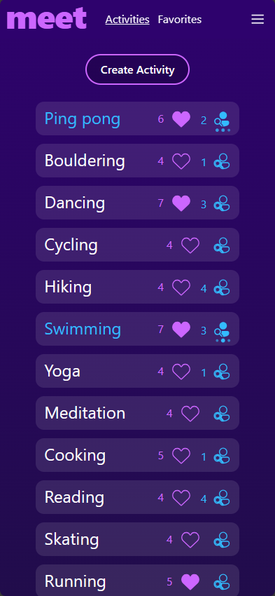
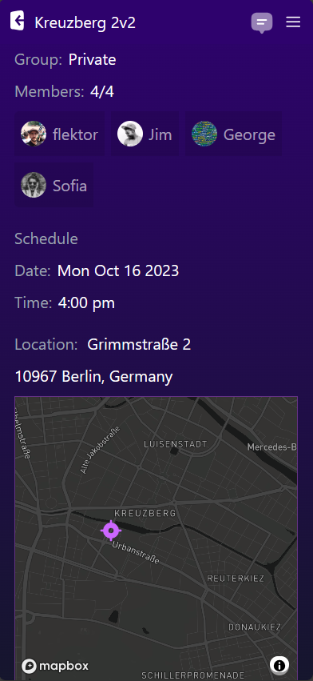
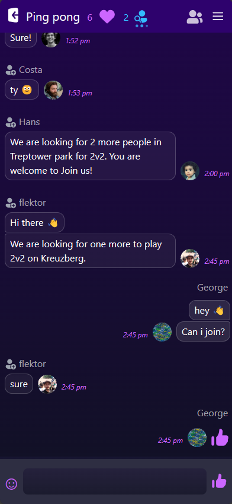

# &nbsp;&nbsp; A social activity app

<!--  -->

Meet is a social app designed for connecting with others and participating in activities together. This project originated as my final project during an intense full-stack coding bootcamp at [SPICED academy](https://www.spiced-academy.com/en) , and has since undergone significant refactoring for educational purposes.

## Table of Contents

1. [Tech Stack](#tech-stack)
2. [Installation and Setup](#installation-and-setup)
3. [Project Description](#project-description)
4. [Usage](#usage)
5. [Features](#features)
6. [Demo and Screenshots](#demo-and-screenshots)
7. [Contributing](#contributing)
8. [Contact Information](#contact-information)
9. [Acknowledgments](#acknowledgments)

## Tech Stack

Meet is built on a [T3 Stack](https://create.t3.gg/), bootstrapped with `create-t3-app`. The technology stack includes:

- [Next.js](https://nextjs.org) for its server-rendering capabilities and seamless development experience.
- [NextAuth.js](https://next-auth.js.org) for secure authentication with social providers.
- [tRPC](https://trpc.io) to provide end-to-end type safety.
- [Prisma](https://prisma.io) for efficient database queries and management.
- [Tailwind CSS](https://tailwindcss.com) for rapid UI development.

### Additional Technologies

While the core stack consists of T3 technologies, Meet also leverages the following additional technologies to enhance its functionality:

- [Zod](https://github.com/colinhacks/zod): A robust data validation library for maintaining data integrity.
- [Zustand](https://zustand-demo.pmnd.rs/): A minimalistic state management library for managing global application state.
- [Pusher.js](https://pusher.com/): Used for real-time messaging, with each activity and group having its dedicated channel.
- [Mapbox](https://www.mapbox.com): Used for setting meeting locations on maps.

### Why This Stack?

The combination of tRPC, Zod, and TypeScript provides end-to-end type safety, minimizing runtime errors and enhancing code quality. Next.js, with its dynamic routing capabilities, allowed for the creation of dynamic activities and group pages. The real-time messaging powered by Pusher.js ensures that each activity and group has its dedicated channel for instant communication.

## Installation and Setup

To set up Meet on your local machine, follow these steps:

1. Clone the repository: `git clone https://github.com/flektor/meet.git`
2. Install project dependencies: `npm install`
3. Configure environment variables, including API keys and database connection.
4. Start the development server: `npm run dev`

## Project Description

Meet is a social app that aims to help people with shared interests connect and schedule activities together. This project was originally developed as my final project at a coding bootcamp, and it has been refactored and improved to showcase my development skills.

## Usage

Meet offers a range of features, including:

- Authentication with GitHub, Google, and Discord through NextAuth.js.
- Real-time chat messaging powered by Pusher.js.
- Activity creation and scheduling.
- Group creation and joining (public/private).
- Quick group searching, allowing users to find others and create a group automatically.
- Setting meeting locations using Mapbox.
- Responsive design for various devices.

## Features

**Why Choose Meet:**

Meet helps people find others who share their interests and enables them to schedule activities together.

**What's Next:**

In the future, I plan to enhance Meet with the following features:

- Advanced search and filtering for specific activities or groups.
- Personalized content recommendations based on favorites, memberships, and follows.
- Configurable quick group search options, including location-based searching.
- Notifications display for the real-time updates.
- User-to-user following functionality.
- Return to the previous action after a required login, keep the state.
- Refactoring of the global state management.
- Encrypt the private content
- More..

## Demo and Screenshots

Here are some screenshots of Meet in action:

For a live demo, visit [Meet Demo](https://meet-demo.vercel.app)

## Contributing

Any contributions or suggestions are welcome.

<!-- If you'd like to contribute to Meet, please follow our [Contribution Guidelines](link-to-contribution-guidelines.md).

## License

Meet is released under the [MIT License](link-to-license.md). -->

## Contact Information

Feel free to contact me if you have any questions or would like to discuss Meet further. You can reach me at [gdrosin@gmail.com](mailto:gdrosin@gmail.com).

## Acknowledgments

- I would like to thank the developers and communities behind the technologies and libraries used for making this project possible.

- SVG icons downloaded from [SVGRepo](https://www.svgrepo.com/).

- Emoji icons found on [getemoji.com](https://www.getemoji.com/).
